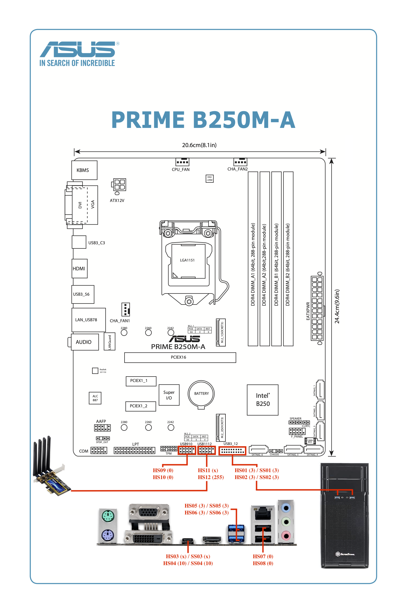

EFI-ASUS-B250M
========

中文 | [English](README_en.md)

## 硬體資訊

| 配置     | 產品型號                               |
| :------- | :------------------------------------- |
| 主板     | ASUS Prime B250M-A                     |
| 處理器   | Intel Core i7-7700                     |
| 記憶體   | Micron Crucial DDR4-2400-8G*2          |
| 硬碟     | Micron Crucial MX500 500GB             |
| 內顯     | Intel HD Graphics 630（id=0x59120003）  |
| 外顯     | ASUS STRIX RX470 O4G GAMING            |
| 音效卡   | Realtek ALC887（id=52）                 |
| 有線網卡  | Realtek RTL8111H                       |
| 無線網卡  | Fenvi FV-T919（WiFi+Bluetooth）         | 
| 顯示器    | ASUS VH228                             |
